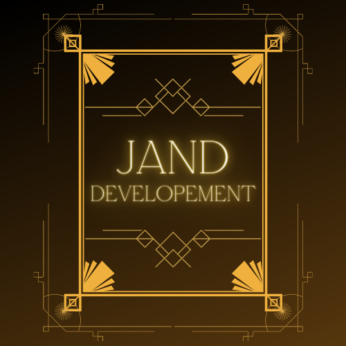
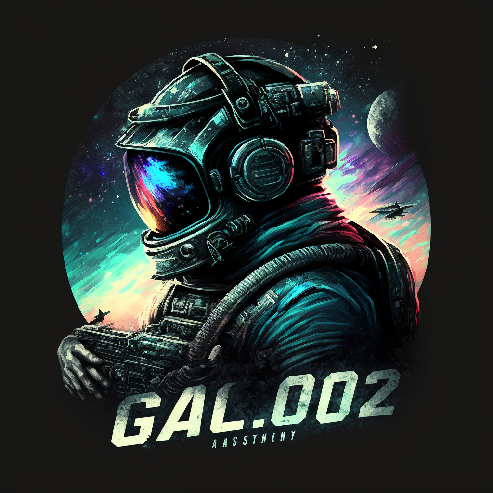

# JAND Developement
Zwei Typen mit viiiiiel Langeweile XD

## Übersicht

- [Übersicht](#übersicht)
- [Vorstellung](#wer-sind-wir)
- [Was ist GAL.002?](#gal.002)

## Wer sind wir

Hi!
Dürfen wir uns kurz vorstellen?
Wir sind Robin und Chris, wir sind das Team von JAND.
Als ein Hobby haben wir immer mal wieder an Discord Bots gebastelt und diese bisher stets als kleine private Projekte gesehen.
Das machen wir nun open-source (naja, zumindest größtenteils XD). [GAL.002](https://github.com/JANDdevelopement/GAL.002) ist ein gutes Beispiel, dieser Bot ist vor kurzem veröffentlicht worden.
Doch auch Projekte die nicht open source sind verwalten wir hier, "TempLounge" zum Beispiel.
Gemeinsam versuchen wir sowohl unsere Kentnisse zu vertiefen, als auch anderen hin und wieder Projekte präsentieren zu dürfen.

## GAL.002
ChatGPT in Discord.

GAL.002 ist unser erstes Projekt, das wir hier als open source Repository zur Verfügung stellen.
Es ist ein Discord Bot der mithilfe eines OpenAI Tokens fähig ist, ChatGPT in Discord zu nutzen.
Schreibt man den Bot also nun per DM an, antwortet er als ChatGPT mit dem Auftrag, die Rolle eines hilfreichen Assistenten anzunehmen.

Den Namen hat dieses Projekt von Chris, Chris heißt auf diversen Plattformen "MR Galaxy" oder "Gaming_Galaxy200".
Man erkennt bestimmt schon die Ähnlichkeit ^^. 

Lust den Bot auszuprobieren? Installiere ihn doch einfach mal selbst und probiere das System aus!
Wir würden uns über eine Rückmeldung freuen ;)